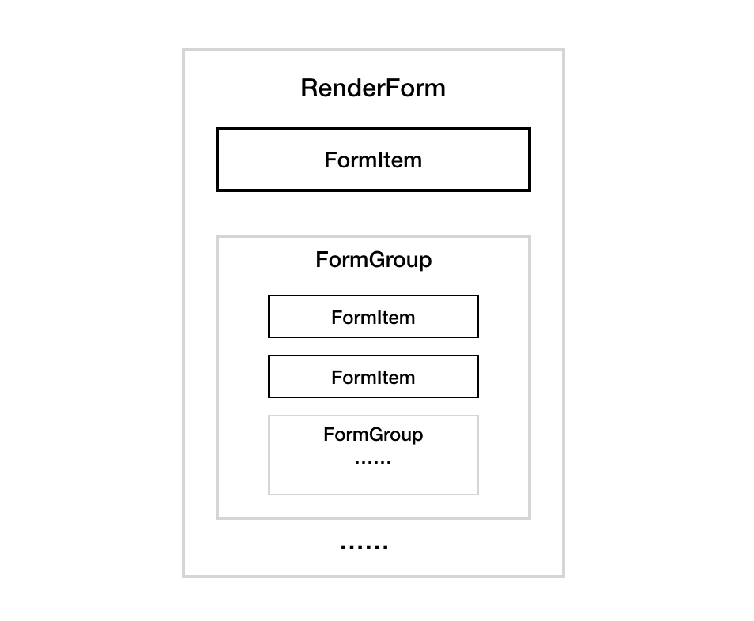
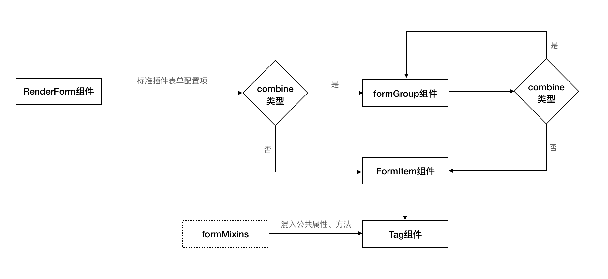

## 概述

标准插件的表单项渲染和事件交互，基于事先定义好的 Tag 组件。一个 Tag 组件可以理解为一种类型的表单封装(如 input、textarea、table、upload 等），通过在原生表单元素或者特定业务组件上扩展属性和方法，为标准插件的开发和使用提供了便利。标准插件一般包含一个或者多个 Tag 组件，前端页面加载标准插件配置文件，读取每个表单项的 type 字段，渲染生成对应类型的表单。

## 如何使用 Tag 组件

Tag 组件的使用非常简单，只需要在标准插件配置项中定义好 `type` 字段，传入该类 Tag 支持的属性和方法即可在前端页面渲染出对应的表单项，通过 Tag 组件之间的组合，也可以构造出复杂的表单交互。

目前标准运维系统内置的 Tag 组件包含：

- button
- checkbox
- datatable
- datetime
- input
- int
- ipSelector
- password
- radio
- select
- text
- textarea
- tree
- upload

## Tag 组件属性、方法

在标准插件配置项中定义好 Tag 组件的类型后，可以通过传入自定义的属性值，满足不同标准插件的需求，例如 `TagSelect` 组件可以通过配置 `multiple` 属性来区分下拉框为单选还是多选，`TagUpload` 组件可以通过配置 `remote_data_init` 属性来自定义加载数据后的处理逻辑。

不同的标准插件在前端页面渲染时，存在一些公共的交互逻辑，包括表单项名称、是否隐藏、是否可勾选、是否校验等。由于 Tag 组件内部封装的原生表单或者特定业务场景的类型差异，不同 Tag 组件之间所支持的属性也会存在差异，这类属性为 Tag 组件的私有属性， 比如 `TagUpload` 组件的 `remote_data_init` 属性。

**配置文件里定义的表单项属性和方法，只有在 Tag 组件里声明过，才能够被组件正确的拿到。**

### 公共属性列表

- `name`，表单项名称，在页面上控制 label 的显示
- `hookable`，是否可勾选为全局变量
- `validation`，表单项的校验规则
- `default`，表单项的默认值，不同的 Tag 组件支持的数据类型存在差异
- `hidden`，是否隐藏
- `value`，表单组件的值，需要在 Tag 里手动定义，并作为调用 `getFormMixins` 函数的参数传入

另外为了增加标准插件的交互能力， Tag 组件也封装了部分公共方法，支持开发者在标准插件配置项的事件回调里进行调用。

### 公共方法列表

- `updateForm`，触发`change`事件更新表单值，并调用校验函数，参数为 `value`
- `validate`，校验函数
- `show`，表单隐藏
- `hide`，表单显示
- `get_form_instance`，获取表单实例，FormItem
- `get_parent`，获取 combine 实例或根元素实例
- `_get_value`，获取表单值
- `_set_value`，设置表单值

### 系统内置 Tag 组件

**1. TagButton**
  - `title`，按钮文字
  - `type`，按钮类型
  - `icon`，icon 类名, 取值参考 [element-ui icon](https://element.eleme.cn/#/zh-CN/component/icon)
  - `size`，尺寸
  - `plain`，是否为朴素按钮
  - `round`，是否为圆角按钮
  - `circle`， 是否为圆形按钮

**2. TagCheckbox**
  - `item`，提供选择的多选项，eg: [{name: '微信', value: 'weixin'}, {name: '邮件', value: 'mail}]
  - `value`，选中的值

**3. TagDatatable**
  - `columns`，表格列的配置项， eg: [{tag config}]
  - `editable`，是否显示编辑、删除按钮列
  - `add_btn`， 是否显示添加按钮
  - `empty_text`，无数据提示
  - `remote_url`，表格数据远程加载，支持 url 和方法
  - `remote_data_init`，加载数据后的处理函数
  - `value`，表格的值

**4. TagDatetime**
- `placeholder`，占位文本
- `value`，时间值

**5. TagInput**
- `placeholder`，占位文本
- `value`，输入框值

**6. TagInt**
- `placeholder`，占位文本
- `value`，整数输入框值

**7. TagIpSelector**
- `isMultiple`，ip 选择器是否为多选（同时选择静态、动态 ip）
- `value`，选择的 ip 值

**8. TagPassword**
- `value`，密码值

**9. TagRadio**
- `items`，提供选择的单选项，eg: [{name: '微信', value: 'weixin'}, {name: '邮件', value: 'mail}]
- `value`，选中的值

**10. TagSelect**
- `items`: 提供选择的下拉框选项， eg:[{text: '微信', value: 'weixin'}, {text: '邮件', value: 'mail'}]
- `multiple`，是否为多选
- `remote`，是否开远程加载
- `remote_data_init`，远程加载后的数据处理函数
- `placeholder`，占位文本
- `empty_text`，无数据提示
-  `value`， 选中的值

**11. TagText**
- `value`，文本的值

**12. TagTextarea**
- `placeholder`，占位文本
- `value`，文本框的值

**13. TagTree**
- `items`，提供选择的可选项,
- `expanded_keys`，默认展开的节点的 key 的数组
- `show_checkbox`，节点是否可被选择
- `default_expand_all`， 是否默认全部展开
- `remote`， 是否开启远程加载
- `remote_url`， 远程加载 url
- `remote_data_init`，远程加载后的数据处理函数
- `value`，选中的值

**14. TagUpload**
- `url`， 服务器 url
- `multiple`，是否支持多个上传
- `headers`，http 请求头
- `auto_upload`，是否开启自动上传，默认为手动，选择文件后需要手动点击上传
- `limit`，上传文件个数
- `placeholder`，占位文本
- `text`，上传按钮的文字
- `value`，上传的文件

## 如何添加 Tag 组件

### 标准插件渲染逻辑

标准插件表单项的渲染由 RenderForm 组件分发，RenderForm 基于 Vue 封装，利用了数据双向绑定的提供的便利，实现了表单项取值与根组件的自定义 v-model，调用组件时只需传入对应的配置项 props，就可以实现父组件与 RenderForm 内部组件的数据自动同步。

配置文件里每一个表单项配置在前端组件渲染底层对应一个 FormItem 组件，一般情况下(非勾选状态) FormItem 组件下都包含一个 Tag* 子组件， Tag 的类型由配置项的 type 字段定义，目前支持的类型包括: input、textarea、checkbox、radio、select、table、upload、tree、password等，所有 Tag 组件都定义了一些公共的属性或者方法，若某种 Tag 类型需要支持的特定事件或者功能，则在对应的 Tag 子组件里定义。另外对于较复杂的使用场景，也可根据需求自定义扩展 Tag 类型。

RenderForm 组件的结构：

标准插件表单的渲染流程：

formMixins 函数定义了一些 Tag 组件公共的属性和方法，在添加 Tag 组件调用该方法来混入，可以避免编写重复的声明。

公共属性分为继承属性和非继承属性，继承属性在 Tag 组件里会被定义为 props 属性，目前只有 value 属性，非继承属性会被转换为 data 属性，它的值不会动态更新。属性的值，优先取标准插件配置文件里定义的值，若配置项没有对应属性的默认值。

Tag 组件的私有属性在添加组件时定义，属性的取值和公共属性一致，优先取标准插件配置文件里的值，若配置项没有对应属性则取默认值。

### 添加 Tag 组件步骤

添加 Tag 组件只需要在前端项目的`src/components/tags/`目录里增加一个单文件的 vue 组件，文件名称格式为`Tagxxx`，`xxx`为 Tag 组件的名称，命名遵循驼峰规则且保证在项目所有`Tag`里是唯一的。webpack 在打包是会查找该目录下的文件，自动引入并注册到 `FormItem` 组件里。模版最外层元素建议增加一个 `tag-xxx`的 `class` 名称，`xxx` 表示 Tag 的名称。

组件的编写需要注意一下几点：

- 是否展示模式、是否为编辑态
  
  RenderForm 组件为通用组件，标准运维所有页面的标准插件表单渲染都通过使用该组件来实现，页面不同地方可能会区分编辑态、禁用态，表单模式、查看模式，所以在编写组件模版是需要针对不同的场景写不同的模版，编辑、禁用通过`formEdit`属性区分、是否表单模式通过`formMode`属性区分。

- 定义私有属性，混入公共属性、方法

  编写组件时必须引入公共属性和方法，并且定义好私有属性后调用公共 mixins 函数的参数传入，其中私有属性必须包含 value 属性，属性申明遵循 props 校验规则格式。mixins 函数由前端项目目录`src/components/common/RenderForm/formMixins.js`文件定义。 

- 表单值绑定

  Tag 组件的值必须实现双向绑定，创建一个计算属性来处理绑定逻辑，计算属性的 `get` 由 props 里的 `value` 的值(需要注意引用类型值的深拷贝)，`set`需要调用`updateForm`方法传入修改后的value到组件，触发change事件和校验逻辑。
