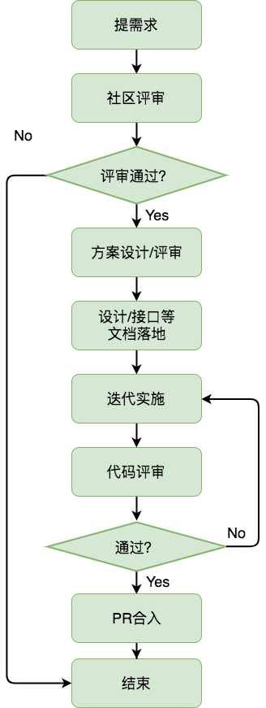

# Issues规则

## BUG提单
如果你在使用标准运维的过程中发现了一个bug，欢迎你通过[提交issue](https://github.com/Tencent/bk-sops/issues/new)
将这个bug反馈给社区来进行定位和修复。针对你提交的bug，还需要你提供一些具体的信息来帮助社区来定位、修复这个问题。

社区需要你提供下面这些基础信息：
* 问题本身的具体内容，可以是一段日志，也可以是web页面上弹出的提示截图等。
* 你使用的版本，也即版本号。
* 问题复现的具体流程。

针对复杂的问题，如果还需要提供其它更为详细的信息，还请你能够及时提供。你提供的信息越多，我们就能越快的定位、解决问题。

为了方便大家提issue，社区提供一个issue的模板帮助大家梳理这些信息。示例如下：

```markdown
问题描述
===========
<这里写问题描述>


重现方法
================
<列出如何重现的方法或操作步骤>


**重要提醒**: 请优先尝试部署使用最新发布的版本 (发布清单： https://github.com/Tencent/bk-sops/releases), 如果问题不能在最新发布的版本里重现，说明此问题已经被修复。


关键信息
=========

**重要提醒**: 这些关键信息会辅助我们快速定位问题。

请提供以下信息:

 - [x] bk_sops   版本 (发布版本号 或 git tag): `<示例： V3.1.32-ce 或者 git sha. 请不要使用 "最新版本" 或 "当前版本"等无法准确定位代码版本的语句描述>`
 - [ ] 蓝鲸PaaS   版本: `<示例：PaaS 3.0.58、PaaSAgent 3.0.9>`
 - [ ] bk_sops 异常日志
```

如果你不确定你发现的是Bug还是Feature，也可以直接提issue，我们来一起看一下。

## 解决BUG
一旦你提交的问题被社区确定为是一个bug，修复的方式有很多种：
  - 如果你对源码很熟悉，可直接将bug修复后，将修改的代码以PR的方式提交给社区，在经过review通过后，合入主库。
  - 如果你对python、vue比较熟悉，想自己修复这个bug，但不知道怎么修复。没关系，社区可以进行指导，帮助你修复这个问题，最终也是通过PR的方式合入主库。
  - 由社区来修复这个bug。

bug修复后，你可以基于这个分支自行部署使用。也可以等社区release新的版本后再使用。

# 提需求
如果你在使用标准运维的过程中发现目前的版本还无法满足你的某些需求，欢迎[创建issue](https://github.com/Tencent/bk-sops/issues/new)
将你的需求反馈给我们。社区希望你的需求能够：
- 具有普适的使用场景。
- 在标准运维产品形态的适用范围内。

对于简单的需求，你可以在issue里描述清楚即可。

当然，如果你的需求比较复杂，那么你在提需求的同时，如果能给出需求落地的实施方案那就更好了。具体可以包含，但不局限于以下内容：
* 需求产生的背景；
* 实现这个特性的设计方案；
* 需要调整的组件有那些；
* 代码实现方案；

社区在收到你的需求以后，会在社区范围内对你的需求、方案进行评审。具体的流程如下：


